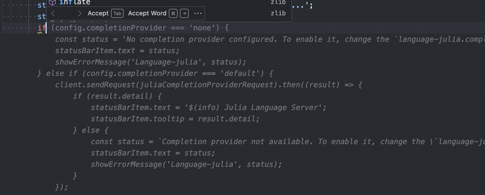

Code Autocomplete VSCode Extension Example
This is an example using the https://api-inference.huggingface.co/models/bigcode/starcoder/ API for code suggestions.
This repository is an example of a VSCode extension. It uses Huggingface's API to provide code suggestions.
The use of the plugin requires setting up a token (https://huggingface.co/settings/tokens).

Usage
git clone https://github.com/myersguo/como
code como
npm install
vsce package
install from vsix

